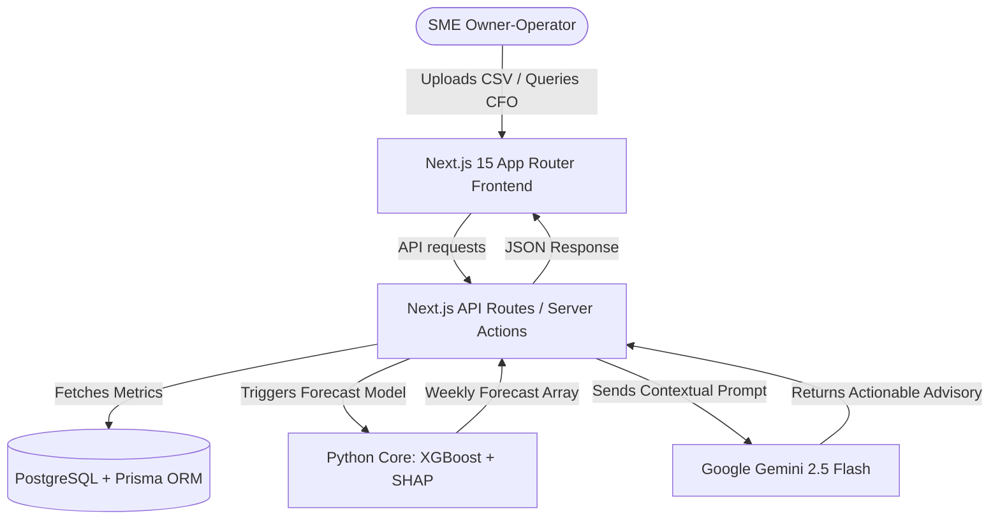

# Gemma SME Growth & Advisory Agent: AI Financial Copilot
**AI for Social Impact Challenge — StartupTN & HCL Foundation**

This document details the project condition, technical architecture, and system value for the AI Financial Copilot tailored for manufacturing SMEs in Peenya, Bengaluru (exemplified by Meenakshi Precision Components).

---

## 1. Problem Statement

Bengaluru's manufacturing hubs (e.g., Peenya CNC clusters) generate substantial operational data through invoices, purchase orders, ledger entries, and supplier timelines. However, owner-operators face critical challenges in translating this data into sound financial decisions:

*   **The Interpretation Gap**: Small and Medium Enterprises (SMEs) lack dedicated finance, pricing, or business intelligence functions. Raw data remains locked in disjointed spreadsheets and accounting software.
*   **Severe Credit Gaps & Cash Flow Risks**: 60% of SMEs seeking capital do so merely to manage cash flow rather than fund growth. Late payments and long receivables aging cycles severely restrict working capital.
*   **Cost Volatility**: High sensitivity to external market fluctuations (e.g., steel indexes, machinery consumables cost) directly erodes operating margins.
*   **Information Asymmetry**: Owners cannot continuously track macro-market signals, supply chain shipping delays, or long-term structural sector shifts (like the ICE-to-EV automotive transition).

---

## 2. Proposed Solution

The **Gemma SME Growth & Advisory Agent** acts as an autonomous, full-stack **AI Financial Copilot**. It acts as the missing interpretation layer between raw numbers and business decisions:

*   **Dynamic Revenue Forecasting**: Combines machine learning predictions (XGBoost) with SHAP feature contribution charts, explaining exactly what factors are driving future cash flows.
*   **Active Pricing Guardrails**: Dynamically updates bill-of-materials (BOM) estimates, margins, and watchlists based on raw material indexes.
*   **Behavior-Grounded Collections**: Analyzes customer ledger payment delays, generates aging risk tiers, and drafts customized, behavior-grounded outreach messages (Email, WhatsApp, Phone scripts) using Gemini.
*   **Conversational CFO Chat**: Provides a full-screen, conversational interface (`/ask-ai-cfo`) grounded in uploaded sales logs and macro market indices for context-aware Q&A.
*   **What-If Scenario Simulator**: Allows owner-operators to adjust key slides (orders volume, material cost, payment delays) to instantly visualize impact on cash flow.

---

## 3. Technical Architecture

The platform is engineered using a modern, performant, and type-safe serverless stack:

### Key Technical Specs:
*   **Frontend**: Next.js 15 (App Router, Tailwind CSS, TypeScript, Lucide Icons, Recharts).
*   **Database layer**: Prisma ORM with a PostgreSQL database, utilizing a TCP connection pool via `@prisma/adapter-pg` to ensure zero native binary engine compile issues on serverless architectures.
*   **AI/ML Core**:
    *   **Python Engine**: Processes weekly aggregated data to run an XGBoost regressor for forecasting and calculates SHAP values for prediction drivers.
    *   **Google Gemini**: Connected via `@google/genai` to analyze raw operational indicators, market news RSS feeds, and customer payment logs, outputting contextual guidance and printable briefing briefs.

---

## 4. Market Viability & Impact

The SME market represents a significant opportunity for automated advisory tooling:

*   **Target Market**: Over 63 million MSMEs in India. In Bengaluru alone, clusters like Peenya house thousands of toolrooms and CNC machine shops operating on thin margins.
*   **Financial Impact**:
    *   **Unlocking Cash Flow**: By identifying late-paying customers early and generating firm but professional automated outreach, the agent reduces Days Sales Outstanding (DSO) by an estimated 15-20%.
    *   **Margin Protection**: Real-time margin updates prevent operators from signing lock-in contracts below raw steel market costs.
*   **Social Impact**: Bridging the formal credit gap (estimated at ₹30 lakh crore nationally) by generating structured, bank-ready briefing reports (`/reports`) showing transparent cash-flow predictions and risk audits.

---

## 5. System Demo & Next Steps

### Current Working Demo Status
1.  **Sales Data Core**: Fully dynamic sales forecasting, SHAP driver analysis, scenario simulators, customer payment logs, and CFO conversational chat update immediately when a sales history CSV is uploaded.
2.  **Seeded Core**: Pricing, inventory stock levels, supply chain steppers, and structural EV transition risks render simulated models from the seed database.

### Next Steps for Implementation
*   **ERP/Tally Integration**: Develop direct API connectors to sync invoice registers directly from Tally Prime or Zoho Books.
*   **BOM OCR Pipeline**: Build a document parsing handler to automatically ingest PDF supplier invoices and update Prisma's `Material` cost models in real time.
*   **Automated Communication Hooks**: Connect the Collections Agent drafts directly to WhatsApp Business and Twilio SMS APIs for one-click payment reminders.
