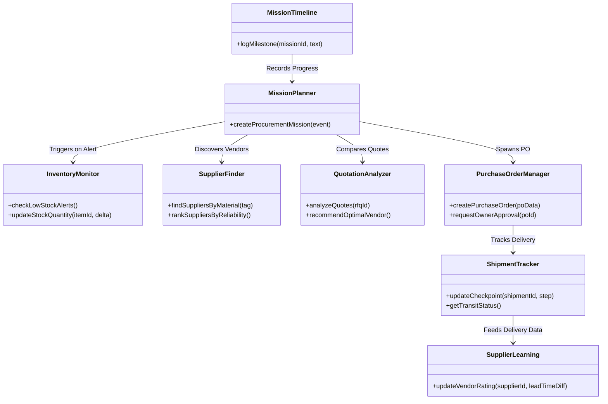

# Procurement Department Reference Implementation & Master Specification

## 📌 Executive Overview
The **Procurement Department** serves as the **gold-standard reference implementation** for autonomous AI business departments within the **FinCent AI Manufacturing Operations Platform**.

Its primary mandate is to ensure **uninterrupted raw material and tooling supply continuity** for precision SME manufacturing while optimizing procurement lead times and vendor cost efficiency.

---

## 🏛️ Core Responsibilities

1. **Inventory Stock Supervision**: Continuously monitoring SKU stock levels against safety thresholds (`minThreshold`).
2. **Automated Vendor Discovery**: Searching registered supplier databases and matching tooling requirements by material tags and reliability ratings.
3. **Quotation Analysis & RFQ Generation**: Generating corporate RFQ letters and analyzing multi-supplier quote matrices.
4. **Purchase Order Execution**: Managing 1-click owner approval gates and generating binding corporate PO documents.
5. **Shipment Logistics Tracking**: Monitoring raw material transit step nodes across logistics checkpoints.
6. **Supplier Reliability Learning**: Continuously updating vendor reliability ratings based on historical shipment lead-time performance.

---

## ✨ Feature Matrix

### Current Operational Features (Phase 1 - 3 Verified)
- ✅ **Automated Low-Stock Alert System**: Emits `InventoryThresholdBreached` when SKU quantity drops below threshold.
- ✅ **Gemma AI Corporate RFQ Generator**: Formats corporate quote request letters addressed to target suppliers.
- ✅ **Multi-Supplier Quote Comparison**: Side-by-side quote matrix comparing pricing, lead times, and reliability.
- ✅ **Supplier Invoice OCR Parser**: Extracts invoice metrics from uploaded PDF/Image documents.
- ✅ **Logistics Transit Node Checkpoint Visualizer**: Interactive tracker monitoring shipment status (`Shipped`, `Customs`, `In Transit`, `Delivered`).
- ✅ **Tally ERP Inventory Sync**: Syncs stock counts and purchase orders with Tally ERP.

### Pending Roadmap Features (Future Scope)
- ⏳ **Live WhatsApp Supplier Dispatch**: Direct automated RFQ dispatch and quote receipt over WhatsApp Business API.
- ⏳ **Geopolitical Material Risk Scoring**: Correlating commodity news RSS signals with vendor lead-time risks.
- ⏳ **Dynamic Automated PO Grouping**: Consolidating multi-SKU orders from the same supplier to reduce shipping surcharges.

---

## 🏗️ Department Architecture Diagram



---

## 🎯 Procurement Mission Lifecycle

Every procurement action operates as a multi-step state machine:

```
[1. Event Trigger] InventoryThresholdBreached (SKU stock < minThreshold)
        │
        v
[2. Mission Planner] Creates Procurement Mission & DAG Workflow
        │
        v
[3. Supplier Finder] Searches registered suppliers matching required SKU tags
        │
        v
[4. Quotation Analyzer] Generates RFQ letter via Gemma AI & compares vendor quotes
        │
        v
[5. Owner Approval Gate] Requests 1-Click sign-off for binding PO creation
        │
        v
[6. PO Execution] Generates corporate PO document & updates Tally ERP
        │
        v
[7. Shipment Tracker] Tracks transit checkpoints until delivery verification
        │
        v
[8. Supplier Learning] Updates vendor reliability rating based on lead-time compliance
```

---

<div align="center">

**Procurement Department Reference Implementation** — *FinCent Architecture Standard.*

</div>
